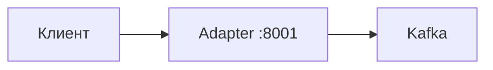

# Webhook → Kafka Adapter

HTTP-шлюз: принимает вебхуки и публикует JSON в топики Kafka. Маршрут → топик задаётся в `config.yaml`.

## Схема



| Компонент | Роль |
|-----------|------|
| HTTP API | `POST /webhook/...`, `GET /get/...`, `GET /health` |
| `url_mapping` | Путь → имя топика |
| Kafka Writer | SASL PLAIN, топик в каждом сообщении |

## POST — вебхук

1. Клиент шлёт `POST /webhook/kaiten/npd` с JSON.
2. Adapter строит путь `/kaiten/npd` и ищет топик в `url_mapping`.
3. JSON уходит в Kafka, клиент получает `200` с `topic` и `url_path`.

Если точного пути нет, но в конфиге есть корень системы (`"/kaiten/"`), используется топик `kaiten_default`.

## GET — клик из письма

1. Браузер открывает `GET /get/ritm/feedback?score=5`.
2. Adapter собирает query в JSON и пишет в топик `ritm_feedback`.
3. Для `ritm_feedback` может вернуться HTML-страница «Спасибо», иначе — JSON.

## Маршрутизация

В `config.yaml` путь **без** префикса `/webhook` или `/get`:

```yaml
url_mapping:
  "/kaiten/": "kaiten_default"
  "/kaiten/npd": "kaiten_npd"
  "/get/ritm/feedback": "ritm_feedback"
```

| HTTP-запрос | urlPath | Топик |
|-------------|---------|-------|
| `POST /webhook/kaiten/npd` | `/kaiten/npd` | `kaiten_npd` |
| `POST /webhook/kaiten/other` | `/kaiten/other` | `kaiten_default` |
| `GET /get/ritm/feedback?x=1` | `/get/ritm/feedback` | `ritm_feedback` |

## Быстрый старт

```bash
cp config.yaml.example config.yaml
# заполните brokers, sasl_*, url_mapping

docker compose up -d --build
curl http://localhost:8001/health
```

Без Docker (Go 1.21+): `go run .`

## Конфигурация

**Приоритет:** переменные окружения → `config.yaml` (локальный, не в git).

| Переменная | Описание |
|------------|----------|
| `CONFIG_PATH` | Путь к YAML (по умолчанию `config.yaml`) |
| `PORT` | HTTP-порт |
| `KAFKA_BROKERS` | Адрес брокера |
| `KAFKA_SASL_USERNAME` | SASL-логин |
| `KAFKA_SASL_PASSWORD` | SASL-пароль |

Шаблоны в репозитории: `config.yaml.example`, `.env.example`.

## Docker

Монтируется с хоста: `config.yaml`, `templates/`, `logs/`.

Сеть `web-out` в compose — external. Если её нет:

```bash
docker network create web-out
```

## Структура

```
.
├── main.go
├── config.yaml.example
├── templates/ritm_feedback.html
├── Dockerfile
├── docker-compose.yml
└── .gitignore
```

## API

| Метод | Путь | Назначение |
|-------|------|------------|
| `GET` | `/health` | Проверка |
| `POST` | `/webhook/:system/*path` | JSON → Kafka |
| `GET` | `/get/:system/*path` | Query → Kafka |

Ошибки: `400` — плохой JSON, `404` — неизвестный путь, `500` — Kafka.

## Новый маршрут

1. Топик в Kafka.
2. Строка в `url_mapping` в локальном `config.yaml`.
3. `docker compose up -d`

## Логи

```bash
docker compose logs -f webhook-kafka-adapter
```

## Секреты

В git только `*.example`. Не коммитьте `config.yaml`, `.env`, `logs/`, бинарники — они в `.gitignore`.

```bash
git status
```
